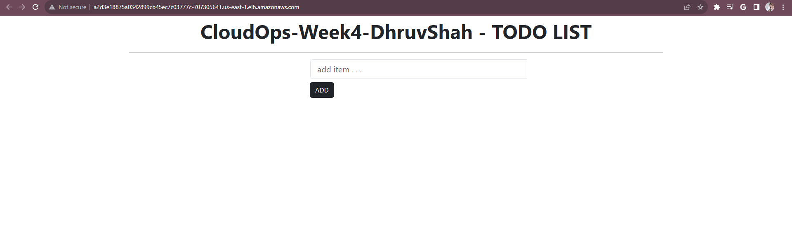

# CloudOps-Week4-Using CircleCI, ArgoCD, and GitOps to deploy a Dockerized application on an AWS EKS cluster.

**Image credits: [Ankit Jodhani](https://www.linkedin.com/in/ankit-jodhani/)**

## Project Description

Imagine you're orchestrating a symphony of code and infrastructure, and your maestro's baton is a trio of Git repositories. Each repository plays a unique role in creating a harmonious deployment pipeline.

🎵 **[Application Code Repository](https://github.com/DhruvS0/CloudOps-Week4-AppCode)** 🎵
This is where the developers take center stage, composing the melodies of your application. With every change and commit, they add new musical notes to the sheet music, making the application evolve.

🎵 **[Terraform Code Repository](https://github.com/DhruvS0/CloudOps-Week4-ArgoCD-CircleCI)** 🎵
Now, picture this repository as your stagehands, working behind the scenes to set up the grand theater - an EKS (Elastic Kubernetes Service) Cluster. The Terraform code repository holds the blueprints and instructions for building this infrastructure.

🎵 **[Kubernetes Manifest Repository](https://github.com/DhruvS0/CloudOps-Week4-kube_manifest)** 🎵
This is where you keep the choreography for your dancers, written in the form of YAML files. These manifest files describe how your application's components should be deployed and perform on the Kubernetes stage.

Now, let's cue the orchestra for the main performance - the GitOps workflow:

🎶 **Act 1: The Developer's Overture** 🎶
Our virtuoso developer creates a new feature, turning their creative ideas into code. This code is committed to the Application Code Repository, like a musician adding new notes to a composition.

🎶 **Act 2: The CircleCI Symphony** 🎶
As if by magic, CircleCI takes notice of this change in the application code repository and raises its baton. It conducts a four-part symphony of tasks:

🔸 **Test (application code)**: The first violin tests the application code to ensure it's in perfect tune.
🔸 **Build (Docker image)**: The orchestra fashions a Docker image, packaging the application with the new feature.
🔸 **Push (Push to Docker registry)**: The ensemble pushes this new image to a Docker registry for safekeeping.
🔸 **Update Manifest (update the manifest repo with a new TAG)**: The conductor updates the Kubernetes manifest repository with a new TAG, indicating the latest version of the application.

🎶 **Act 3: ArgoCD's Ballet of Synchronization** 🎶
The spotlight shifts to ArgoCD, your ballet master of deployment. It's always in sync with your Kubernetes manifest repository. When it sees a change, it leaps into action, performing a beautifully synchronized ballet:

🔹 **Pulls the new manifest**: ArgoCD gracefully fetches the latest choreography (manifest files) from the repository.

🔹 **Applies it to the cluster**: With finesse, ArgoCD instructs the Kubernetes cluster to perform the new dance, deploying the updated application as per the new choreography.

🎶 **Act 4: The GitOps Encore** 🎶
ArgoCD doesn't just take the spotlight; it also guards the stage. If anyone dares to make unauthorized changes to the Kubernetes cluster, ArgoCD, like a diligent usher, swiftly restores the original choreography. It maintains the Kubernetes cluster as a reflection of the Kubernetes manifest repository, ensuring a flawless performance every time.

In this magnificent GitOps orchestra, the Kubernetes manifest repository is the conductor's podium, the EKS Cluster is the grand stage, and the application code repository is where the melodies of innovation are born. Together, they create a symphony of continuous delivery, ensuring that your application always dances to the right tune. 🎶🎭🪅

## Prerequisites
We will need the following accounts to start with the project.
- GitHub Account
- AWS Account
- CircleCI Account
- Docker Account

## Final Outcome
The application we have hosted on the Kubernetes cluster on AWS using CircleCI and ArgoCD.

