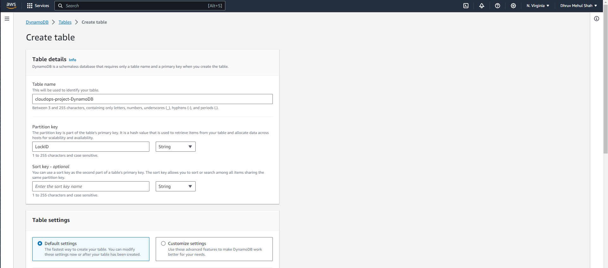

# Step1 - Provisioning Amazon EKS Cluster using Terraform

## Architecture


**Image credits: [Ankit Jodhani](https://www.linkedin.com/in/ankit-jodhani/)**

We will be building the above infrastructure for our project using Terraform. 

## Setting up the local environment
Before procedding further with the infrastructure, it's important to setup a local environment that we would be using to code. 

Here, we will be using VS Code IDE for writing the code and executing it. 

Once, the VS Code is installed, you can clone the repository for the project using the following command:

```sh
git clone https://github.com/DhruvS0/CloudOps-Week4-ArgoCD-CircleCI.git
```
Next, you would require AWS and Terraform CLI to work with in VS Code. For that, I have created scripts to install the CLIs by executing the script. 

You can find the script in `CloudOps-Week4-ArgoCD-CircleCI/ToDo-App/bin/` location.

To install the AWS,Terraform and Kubectl CLI along with the tf alias for Terraform, you can use the following commands if you are on the base folder i.e., `CloudOps-Week4-ArgoCD-CircleCI`:
```sh
cd ToDo-App
cd bin
./install_aws_cli
./install_terraform_cli
./install_kubectl_cli
./set_tf_alias
```
Once, we have our local setup ready, we can proceed further with creation of AWS IAM user.

## Creating AWS IAM User using AWS Console.
First, we will login to the AWS management console and create a new user for the project using the IAM service.
#### Create a User
- Please choose the user tab from the left-hand menu. Click the button in the upper right corner to add a user. Attaching the user's policy is now required. 
- Despite the fact that we ought to follow the least privilege guideline, we must utilize several services. You can grant `AdministratorAccess` here. It is not, however, at all advised. Rather, pick the services from the list and attach the policy accordingly. 
- Select the Create User button after clicking the next button.


#### Generate a Secret Key 
- Click on the user you just created. Select the tab for security credentials. There is an option below called "Create Acess Key." Simply click it. 
- Next, choose CLI, tick the box below, and press the Next button while providing a brief description of it and after that select the "Create Access Key" option. 
- Your Secret Key and Access Key ID are displayed here. You won't be able to view it when you shut your window, so be sure you download it. Additionally, **keep in mind not to provide the key to anyone**.


#### Configure AWS CLI
- Launch your system's terminal and enter `aws configure`. 
- Your secret key ID and access key ID will be requested. Kindly insert the newly produced content. 
- In addition, it will ask for the default location to be `us-east-1` and the output format to be `JSON`. 

**Note:** The area in which you wish to launch your app can be entered.

## Working with Terraform Files

### Best Practices for Terraform
- Store state files on a remote location (Amazon S3 service)
- Try to keep versioning for backups (Amazon S3 service)
- State-locking (Amazon DynamoDB service)

### Configuring Backend for Terraform
Before configuring the Backend for Terraform, we need to create a S3 bucket and DynamoDB Table.
#### To create a S3 bucket
- To create an S3 bucket with the AWS Management Console, navigate to the Amazon S3 service. 
- In the S3 dashboard, create a new bucket with a distinct and globally unique name, ensuring it follows naming rules (lowercase letters, numbers, hyphens, and periods).
- Enable versioning for the bucket to retain multiple versions of objects, which can be crucial for data integrity and recovery. 
- Keep the default settings for encryption and other options. After configuring your preferences, review the settings, and confirm to create the bucket. 


#### To create a DynamoDB Table
- To create an Amazon DynamoDB table using the AWS Management Console, navigate to the DynamoDB service. In the DynamoDB dashboard, initiate the creation of a new table by clicking the "Create table" button. 
- You'll need to configure various settings, including specifying a unique and meaningful name for the table, defining the primary key (partition key and sort key).
- Once you've tailored the settings to your requirements, click "Create" to generate the DynamoDB table. Your new table is now ready for use, and you can start storing and querying data within it.



Let's set up the backend and state-locking. (You must have s3 bucket and Dynamodb table)

You need to open the backend.tf file located at `/ToDo-App/backend.tf`.
```tf
terraform {
  backend "s3" {
    bucket = "GIVE-YOUR-S3-BUCKET-NAME"
    key    = "backend/GIVE-ANY-NAME-TO-YOUR-BACKEND-FILE.tfstate"
    region = "us-east-1"
    dynamodb_table = "GIVE-DYNAMODB-TABLE-NAME"
  }
}
```


### Building the Infrastructure
#### Terraform init
To build the infrastructure using the Terraform, we need to download the binaries & plugins for the project.

At the start of new terraform project we will run `terraform init` to download the binaries for the terraform providers that we'll use in this project.
```tf
terraform init
```


#### Terraform Plan
To generate out a changeset, about the state of our infrastructure and what will be changed.

We can output this changeset i.e., "plan" to be passed to an apply, but often you can just ignore outputting.

```tf
terraform plan
```


#### Terraform Apply
This will run a plan and pass the changeset to be executed by Terraform. Apply should prompt yes or no.

If we want to automatically approve an apply we can provide the auto approve flag. eg., terraform apply --auto-approve

```tf
terraform apply
```


#### Outputs 
After we `terraform apply`, the following resources will be created.


