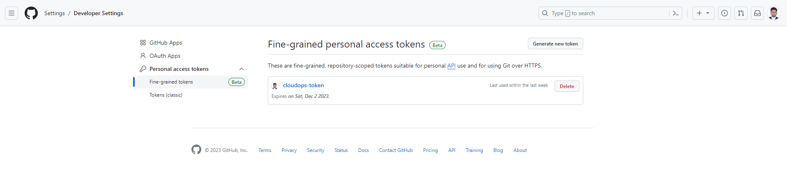
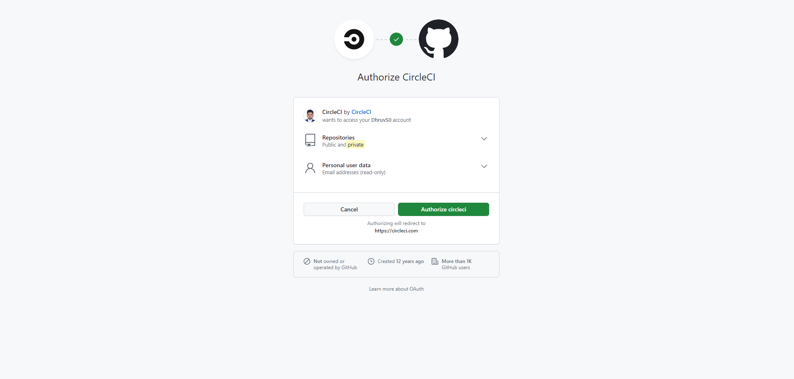
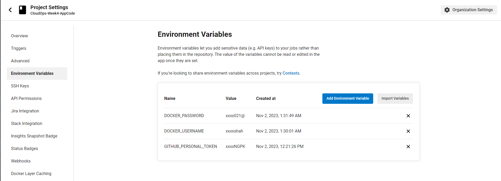
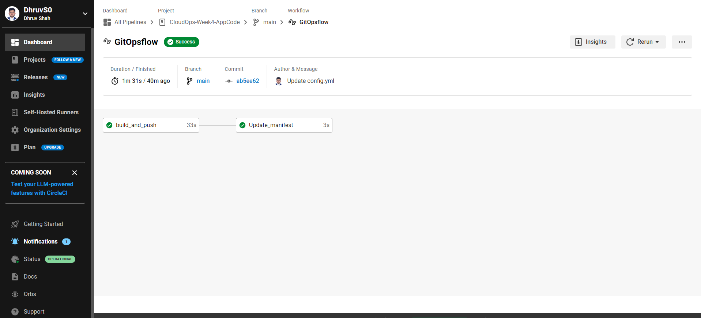

# Step2 - Configure pipeline (CircleCI) and GitHub for Kube manifest

## Architecture


**Image credits: [Ankit Jodhani](https://www.linkedin.com/in/ankit-jodhani/)**

## Setting up the accounts for the project

We would require a CircleCI account and a Docker account to work on the pipelining for the project.

## Description for working of CircleCI
🎶 Act 2: The CircleCI Symphony 🎶
As if by magic, CircleCI takes notice of this change in the application code repository and raises its baton. It conducts a four-part symphony of tasks:

🔸 Test (application code): The first violin tests the application code to ensure it's in perfect tune.

🔸 Build (Docker image): The orchestra fashions a Docker image, packaging the application with the new feature.

🔸 Push (Push to Docker registry): The ensemble pushes this new image to a Docker registry for safekeeping.

🔸 Update Manifest (update the manifest repo with a new TAG): The conductor updates the Kubernetes manifest repository with a new TAG, indicating the latest version of the application.

By using this pipeline, we make sure that our application code is rigorously tested, integrated into Docker images, and released using the GitOps methodology along with the updated manifest.

## Step-by-Step process to building pipeline

Before proceeding further with the pipelining, it's important to get the code in the repo.

Here, we will be creating a new repository for this part, where only the app code and CircleCI yaml file will be hosted.

You can clone the repository for AppCode and CircleCI using the following command:

```sh
git clone https://github.com/DhruvS0/CloudOps-Week4-AppCode.git
```
This repository contains the code for the React application called ToDo-App. I've created this to deploy it on the Kubernetes cluster using the GitOps workflow.

#### Step 1 - Writing and Hosting the `config.yml` and `AppCode` file for CircleCI on GitHub

If you clone the repository, you can find this config.yml file in the `.circleci` folder of the repo. This file is used for configuring the CircleCI to perform tasks. 

```yaml
version: 2.1

jobs:
  build_and_push:
    docker:
      - image: cimg/node:20.3.1
    steps:
      - checkout
      - setup_remote_docker
      - run:
          name: Lets build and push image
          command: |
            version="build-$CIRCLE_BUILD_NUM"
            echo $version
            docker build -t dhruvmshah/todo-app:$version .
            echo $DOCKER_PASSWORD | docker login -u $DOCKER_USERNAME --password-stdin
            docker push dhruvmshah/todo-app:$version

  Update_manifest:
    docker:
      - image: cimg/base:2023.06
    steps:
      - checkout
      - setup_remote_docker
      - run:
          name: Updating Manifest file 
          command: |
            TAG=$CIRCLE_BUILD_NUM
            ((TAG--))
            git clone https://github.com/DhruvS0/CloudOps-Week4-kube_manifest.git
            git config --global user.email "dhruvshah.dms@gmail.com"
            git config --global user.name "dhruvmshah"
            pwd
            cd CloudOps-Week4-kube_manifest
            pwd
            echo $TAG
            sed -i "s/build-.*/build-$TAG/g" manifest/deployment.yml
            cat manifest/deployment.yml
            git add .
            git commit -m "new build with imgTag build-$TAG"
            git config credential.helper 'cache --timeout=120'
            git push -q https://$GITHUB_PERSONAL_TOKEN@github.com/DhruvS0/CloudOps-Week4-kube_manifest main 
workflows:
  GitOpsflow:
    jobs:
      - build_and_push
      - Update_manifest:
          requires:
            - build_and_push
```

#### Step 2 - Writing and Hosting the `Kubernetes Manifest` file for CircleCI on GitHub

Here, we will be creating a new repository for this part, where only the kubernetes manifest file will be hosted.

You can clone the repository for Kubernetes manifest using the following command:

```sh
git clone https://github.com/DhruvS0/CloudOps-Week4-kube_manifest.git
```
This repository contains the code of the kubernetes manifest files.

#### Step 3 - Generating GitHub Token 

Now, go into github account settings ➡️ Developer settings ➡️ personal access token 

and create one personal access token and copy that because CircleCI needs a token to update the Kubernetes manifest repo.



#### Step 4 - Configuring CircleCI and GitHub pipeline

Assuming, you have already created the CircleCI account, we can directly login using the below link via GitHub.

[Circle Ci Login via GitHub](https://github.com/login/oauth/authorize?client_id=78a2ba87f071c28e65bb&redirect_uri=https%3A%2F%2Fcircleci.com%2Fauth%2Fgithub%3Freturn-to%3D%252F&scope=repo%2Cuser%3Aemail&state=21ctY9b00Mh5G7nNQ3hdtEH4dOuiNGiXjf3Py-wO30Ejd8-9WEA9_ERue2OFGYNtB9A5N5Bb-0R4iGgN)




Here, you will see all the repositories that are present in your GitHub account. Select your application code repo and click on the set up project button. Select the main branch. We have already created the `.circleci/config.yml` file, so just click on the fastest radio button and setup the project.

When you set up the project, automatically, CircleCI starts running the pipeline but it will fail because we need DOCKER_USERNAME, DOCKER_PASSWORD, and also GITHUB_PERSONAL_TOKEN. These variables I've used in the config.yml file, so we need to define them.

**DO NOT RUN AGAIN** because we need to add the environment variables.

#### Step 5 - Add the Environment variables

Now go inside the project settings of CircleCI and click on the Environment variable tab on the left panel, here we can write our environment variable. In this way, we don't have to hardcode our credential data, such as our Docker password, username, GitHub token, etc., in the config.yml file.

 


Click on Add environment variable and add all the environment variables that you want to utilize inside the config.yml file. In this project, they are DOCKER_PASSWORD,DOCKER_USERNAME and GITHUB_PERSONAL_TOKEN. 

We did setup successfully, so let's run the pipeline one more time. It will build a new image, push on hub.docker.com, and update the manifest repo with a new tag.



With this, we have successfully created a pipeline involving CircleCI, DockerHub and GitHub repositories.

Let's follow the next part of the project on the last page of journal (Step3 - Installation and Syncing of ArgoCD on the EKS cluster)