# Step3 - Installation and Syncing of ArgoCD on the EKS cluster

## Architecture


**Image credits: [Ankit Jodhani](https://www.linkedin.com/in/ankit-jodhani/)**

## Description for working of ArgoCD

🎶 **Act 3: ArgoCD's Ballet of Synchronization** 🎶
The spotlight shifts to ArgoCD, your ballet master of deployment. It's always in sync with your Kubernetes manifest repository. When it sees a change, it leaps into action, performing a beautifully synchronized ballet:

🔹 **Pulls the new manifest**: ArgoCD gracefully fetches the latest choreography (manifest files) from the repository.

🔹 **Applies it to the cluster**: With finesse, ArgoCD instructs the Kubernetes cluster to perform the new dance, deploying the updated application as per the new choreography.

🎶 **Act 4: The GitOps Encore** 🎶
ArgoCD doesn't just take the spotlight; it also guards the stage. If anyone dares to make unauthorized changes to the Kubernetes cluster, ArgoCD, like a diligent usher, swiftly restores the original choreography. It maintains the Kubernetes cluster as a reflection of the Kubernetes manifest repository, ensuring a flawless performance every time.

In this magnificent GitOps orchestra, the Kubernetes manifest repository is the conductor's podium, the EKS Cluster is the grand stage, and the application code repository is where the melodies of innovation are born. Together, they create a symphony of continuous delivery, ensuring that your application always dances to the right tune. 🎶🎭🪅


## Step-by-step process for installing ArgoCD and hosting the app on EKS

For this, we will need to get the AWS infrastructure and pipelining between CircleCI and GitHub up and running efficiently.

#### Step 1 - Creating Kubeconfig file
Create or update kubeconfig file, if you didn't do that. 
```sh
aws eks update-kubeconfig --region REGION-CODE --name YOUR-CLUSTER-NAME
```

The pods created by us can be checked using the below command:
```sh
kubectl get pods -n kube-system
```
The nodes can be checked using the below command:
```sh
kubectl get nodes
```
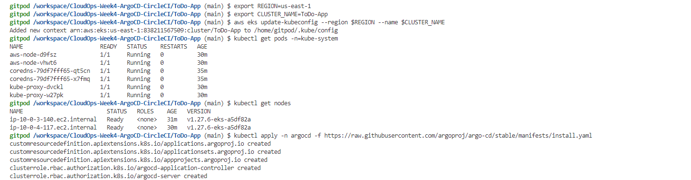

#### Step 2 - Installing ArgoCD

Download the latest Argo CD version from https://github.com/argoproj/argo-cd/releases/latest.

If you face any issues with the installation, try using the curl command below:

```sh
url -sSL -o /usr/local/bin/argocd https://github.com/argoproj/argo-cd/releases/latest/download/argocd-linux-amd64
chmod +x /usr/local/bin/argocd
```

**Note:** The namespace will be created as part of the installation in the above step. If you didn’t, please refer to the below command to create a namespace:

```sh
kubectl create namespace argocd
```
#### Step3 - Creating ArgoCD Objects

To create the ArgoCD Objects, we can use the below command:
```sh
kubectl apply -n argocd -f https://raw.githubusercontent.com/argoproj/argo-cd/stable/manifests/install.yml
```
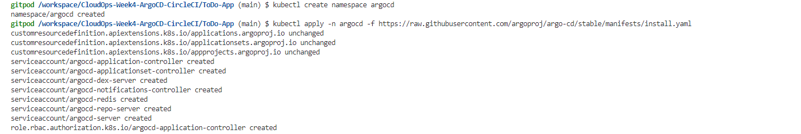

Once the installation is completed, you can check the pods using the following command:
```sh
kubectl get pods -n argocd
```
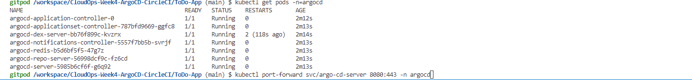

#### Step4 - Publicly accesible ArgoCD-server
Argocd-server is not publically available by default, but we can make it accessible from outside by using port forwarding. Although there are other ways to gain access  such as load balancer, this article will concentrate on using port-forwarding concept.

To make argocd-server public, we use the following command in the terminal:
```sh
kubectl port-forward svc/argocd-server 8080:443 -n argocd
```
This will expose the argocd-server on the localhost:8080 and we can access this by going to the `https://localhost:8080` in the browser.

You will come to the argocd login page. To login, you will need a password with the username as `admin`.

To get the secret we can use the following commands:
```sh
kubectl get secrets -n=argocd
```
Here, we will find the secret for initial admin login named `argocd-initial-admin-secret`. 

To get the password out of it, we need to use the following command:
```sh
kubectl get secret argocd-initial-admin-secret -n argocd -o yaml
```
The password we get is encoded by base64, to decode it we use the following command:
```sh
echo <<Enter the password displayed to you>> | openssl enc -base64 -d
```
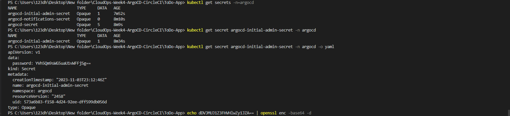

Now, save the decoded password which will be used to login in the argocd server. After logging in, the output would be as shown below:

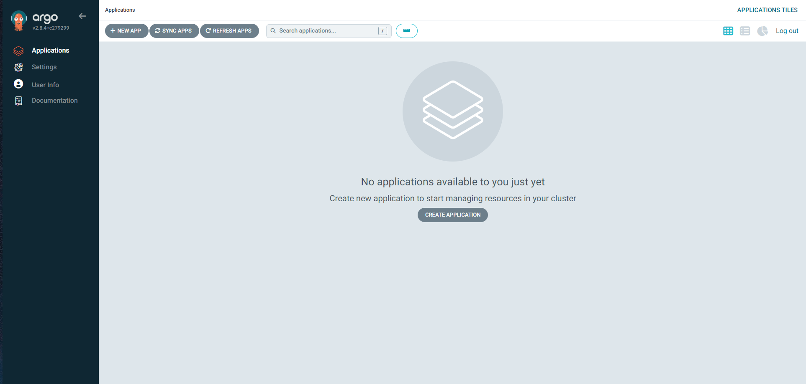

#### Step 5 - Sync the Github Manifest repo with ArgoCD

I'll walk you through configuring synchronization between the GitHub manifest repository and Argocd in this part. Please copy the declarative file shared below and store it to your local computer under any name of your choice to start the procedure.

Please change the repo URL in the below file with your corresponding repo at your GitHub.
```yaml
apiVersion: argoproj.io/v1alpha1
kind: Application
metadata:
  name: todo-app-argo
  namespace: argocd
spec:
  project: default
  source:
    repoURL: https://github.com/DhruvS0/CloudOps-Week4-kube_manifest
    targetRevision: HEAD
    path: manifest
  destination: 
    server: https://kubernetes.default.svc
    namespace: myapp
  syncPolicy:
    syncOptions:
    - CreateNamespace=true
    automated:
      selfHeal: true
      prune: true  
```
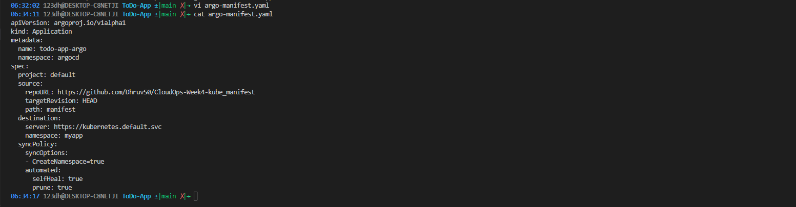

Let’s apply the above file to start the sync process of the Manifest repo with ArgoCD using the below command:
```sh
kubectl apply -f manifest-argo-sync.yaml
```
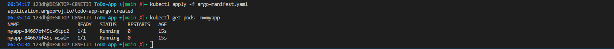

#### Step 6 - ArgoCD UI after successful deployment
Let's look at what has been done in the background to understand the next step better.

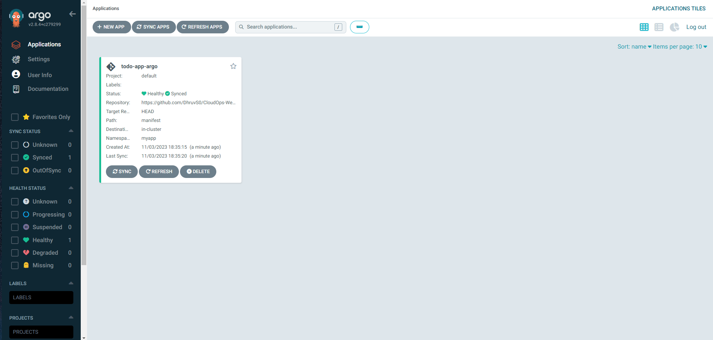

ArgoCD has applied the manifest file. We have configured this file to be created on ALB to access the dockerized application.

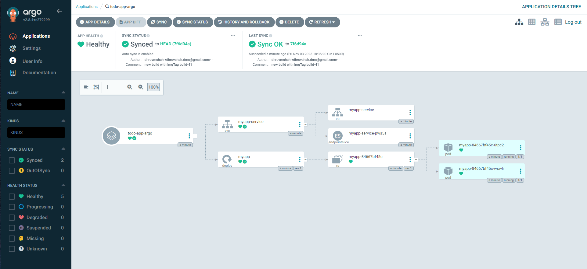

#### Step 7 - Test
Open the LoadBalancer DNS link extracted from the AWS console pointing to our application inside the cluster ToDo-App.

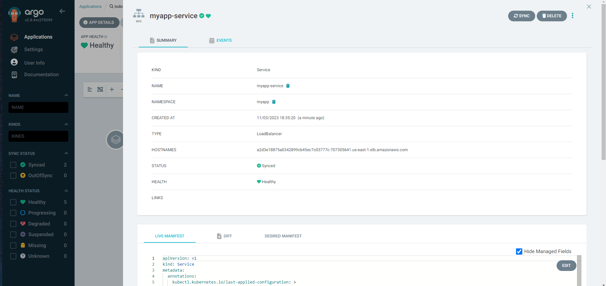

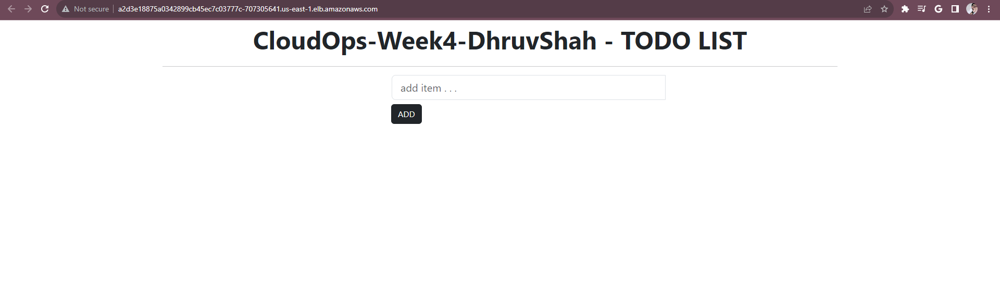


--------------------------------------------------------------------------------
We have succesfully provisioned our app in the AWS EKS cluster using the CircleCI and ArgoCD.
# Summary
- For our deployment, we started by setting up and provisioning an Amazon EKS cluster using Terraform. 
- After that, we set up our pipeline to use CircleCI and GitHub, which allowed the Kubernetes manifests to seamlessly integrate with our project's continuous integration and deployment process. 
- This strategy ensures that our dockerized application on the AWS EKS cluster will be deployed in a simplified and effective manner.


